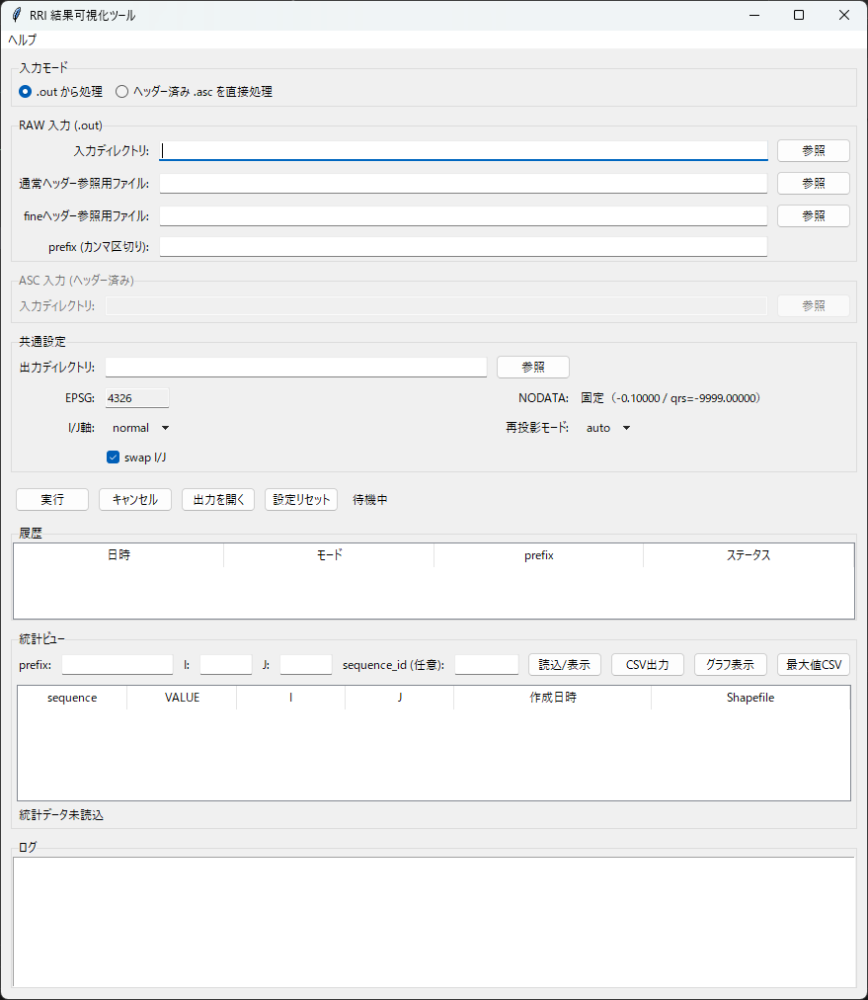

# 結果可視化 GUI (post)

RRI の出力 (`out`) を可視化・集計する GUI です。ヘッダー付与・ベクタ化・統計出力までを一括で実行できます。

## 何ができるか（機能概要）

- **RAW（.out）** を読み込み、**ヘッダー付き .asc** を作成
- **ASC** をベクタ化し、**Shapefile** と **統計データ（parquet/CSV）** を生成
- **統計ビュー** で I/J 座標の時系列値を確認・CSV/グラフ出力
- **最大値ラスター（value_max）** を作成

---

## 画面構成と機能（画面ラベル準拠）

### 入力モード

- **「.out から処理」**
  - RRI 本体の `out` ディレクトリを入力として扱います。
  - 内部で **「通常ヘッダー参照用ファイル:」** と **「fineヘッダー参照用ファイル:」** を使って `.asc` を生成します。
- **「ヘッダー済み .asc を直接処理」**
  - すでにヘッダーが付いた `.asc` を入力として扱います。

### RAW 入力 (.out)

- **「入力ディレクトリ:」**
  - RRI 本体の `out` フォルダを指定します。
- **「通常ヘッダー参照用ファイル:」**
  - 通常格子のヘッダー雛形（`.asc`）を指定します。
- **「fineヘッダー参照用ファイル:」**
  - fine 格子用のヘッダー雛形（`.asc`）を指定します。

> 2つ必要な理由:  
> RRI の `out` には **通常格子**と**fine 格子**が混在します。  
> それぞれ **セルサイズや行列サイズが異なる**ため、別のヘッダー雛形が必要です。  
> fine 格子が存在しない場合は **「fineヘッダー参照用ファイル:」** を空欄にできます。
- **「prefix (カンマ区切り):」**
  - 対象とする prefix を指定します（例: `hf, hs, hr`）。
  - 空欄の場合は、入力から自動検出した prefix 全てが対象になります。

### ASC 入力 (ヘッダー済み)

- **「入力ディレクトリ:」**
  - すでにヘッダーが付いた `.asc` の保存先を指定します。

### 共通設定

- **「出力ディレクトリ:」**
  - 生成物を配置するベースフォルダです。
  - `out_with_header/` と `vectorized/` を自動作成します。
- **「EPSG:」**
  - 現在は **固定 4326** です（変更不可）。
- **「NODATA:」**
  - 固定値を使用します（`-0.10000 / qrs=-9999.00000`）。
- **「I/J軸:」**
  - I/J の向きを指定します。
- **「再投影モード:」**
  - `auto / force / skip` を選択します。
- **「swap I/J」**
  - I/J を入れ替える場合にチェックします。

### 実行ボタン

- **「実行」**
  - 現在の設定で処理を開始します。
- **「キャンセル」**
  - 実行中の処理を中断します。
- **「出力を開く」**
  - `vectorized/` をエクスプローラーで開きます。
- **「設定リセット」**
  - 保存済みの GUI 設定を初期化します。

### 履歴

- **「履歴」** に処理日時・モード・prefix・ステータスが記録されます。

### 統計ビュー

- **「prefix:」「I:」「J:」**
  - 参照対象の統計を指定します。
- **「sequence_id (任意):」**
  - 任意で対象の時系列番号を指定できます。
- **「読込/表示」**
  - 統計データを読み込み、一覧に表示します。
- **「CSV出力」**
  - 表示中の統計データを CSV で保存します。
- **「グラフ表示」**
  - VALUE の時系列グラフを表示します。
- **「最大値CSV」**
  - prefix 単位の最大値一覧を CSV 出力します。

### ログ

- **「ログ」** に処理状況が表示されます。

---

## 出力の意味（実装ベース）

- `out_with_header/`
  - RAW（.out）にヘッダーを付与した `.asc` が保存されます。
- `vectorized/`
  - ベクタ化された Shapefile / 統計データ / 画像などが出力されます。
- `vectorized/stats/*.parquet`
  - 統計ビューが参照する時系列データです。
- `value_max/`
  - `prefix_XXXXXX.asc` 形式の最大値ラスターが保存されます。

---

## 注意点

- EPSG は固定設定です（現在 4326）。
- `parquet` 出力には追加ライブラリ（`pyarrow` または `fastparquet`）が必要です。
- RAW 入力時は **「通常ヘッダー参照用ファイル:」** が必須で、fine 格子が存在する場合は **「fineヘッダー参照用ファイル:」** も指定してください。
- 入力ディレクトリと出力ディレクトリは同一にしないでください。
