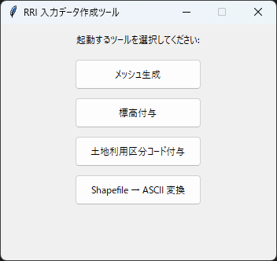
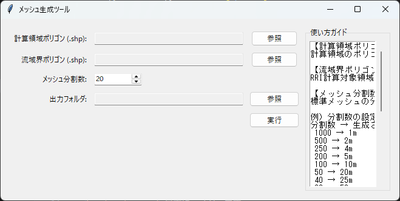
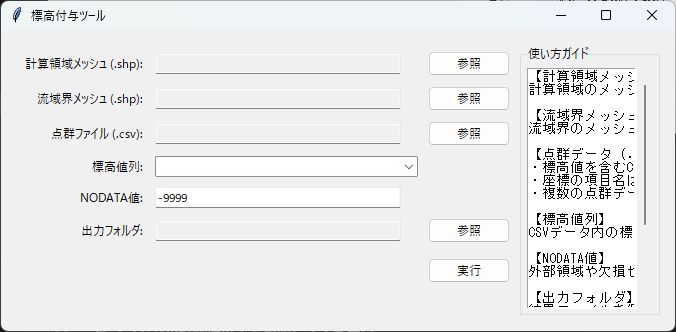
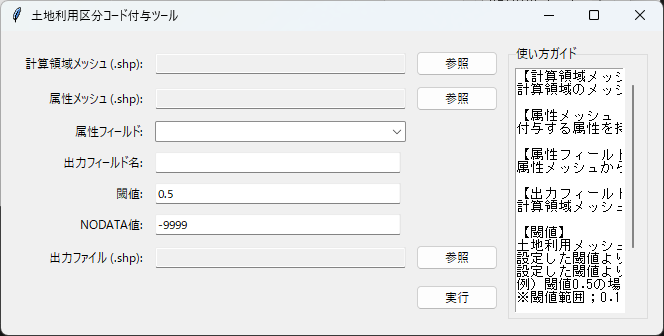
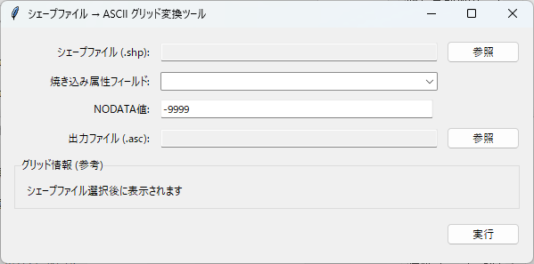

# 入力データ作成 GUI (pre)

入力データを作成する GUI です。起動すると **「RRI 入力データ作成ツール」** のランチャーが開き、次の4つのツールを選択できます。

- **「メッシュ生成」**
- **「標高付与」**
- **「土地利用区分コード付与」**
- **「Shapefile → ASCII 変換」**

以下では、各ツールの画面に表示される **GUIラベル名** に沿って設定内容を説明します。

## 何ができるか（機能概要）

- **「メッシュ生成」**
  - 計算領域ポリゴンと流域界ポリゴンから、RRIで使う**計算格子メッシュ**と**流域メッシュ**を生成できます。
  - **「メッシュ分割数:」** で格子の細かさを調整できます。
- **「標高付与」**
  - 計算領域メッシュ／流域界メッシュに対して、CSV点群から**標高値を割り当て**できます。
  - **「標高値列:」** で標高列を選択し、欠損は **「NODATA値:」** で埋めます。
- **「土地利用区分コード付与」**
  - 計算領域メッシュに、属性メッシュの**代表属性（dominant）**を付与できます。
  - **「閾値:」** で重複率を判定し、一定未満は **「NODATA値:」** を設定します。
- **「Shapefile → ASCII 変換」**
  - シェープファイルの属性列を **ASCIIグリッド（.asc）** に変換できます。
  - **「グリッド情報 (参考)」** でセル数やセルサイズを自動確認できます。

## メッシュ生成ツール

### 設定項目（画面ラベル）

- **「計算領域ポリゴン (.shp):」**
  - 計算対象となる領域ポリゴンを指定します。
- **「流域界ポリゴン (.shp):」**
  - 流域界ポリゴンを指定します。RRI計算対象域の切り出しに使用します。
- **「メッシュ分割数:」**
  - 標準メッシュの分割数です。数値が大きいほど細かくなります。
- **「出力フォルダ:」**
  - 生成結果の出力先フォルダを指定します。
- **「実行」**
  - 入力内容で処理を開始します。

### 機能の説明（詳細）

- **「計算領域ポリゴン (.shp):」** と **「流域界ポリゴン (.shp):」** から、計算領域と流域界を同一のメッシュ基準で整合させたメッシュを作成します。
- **「メッシュ分割数:」** は生成される格子の細かさに直接影響します。値を大きくするとセルが細かくなり、境界形状をより忠実に表現できます。
- **「出力フォルダ:」** に、計算領域用・流域界用などのメッシュシェープが出力されます。

### 出力の意味（実装ベース）

- `domain_standard_mesh`
- `domain_mesh`
- `basin_mesh`

- `domain_standard_mesh` は、標準メッシュから **「計算領域ポリゴン (.shp):」** と交差するセルだけを抽出したものです。
  - GUI では標準メッシュが内部で固定されており、ユーザーが直接変更する項目はありません。
- `domain_mesh` は計算領域を覆う計算格子メッシュです。
- `basin_mesh` は流域界を覆う計算格子メッシュです。

### データ粒度の目安

- **「メッシュ分割数:」** は X/Y 方向のセル数に対応します。
- 分割数が大きいほどセルが細かくなり、境界形状は滑らかになりますが、後段処理が重くなります。

---

## 標高付与ツール

### 設定項目（画面ラベル）

- **「計算領域メッシュ (.shp):」**
  - 計算領域のメッシュ化済みポリゴンを指定します。
- **「流域界メッシュ (.shp):」**
  - 流域界のメッシュ化済みポリゴンを指定します。
- **「点群ファイル (.csv):」**
  - 標高値を含むCSVを指定します。複数選択が可能です。
  - 座標列は `x,y` または `X,Y` が前提です。
- **「標高値列:」**
  - CSV内の標高列名を選択します。
- **「NODATA値:」**
  - 欠損セルに設定する値（デフォルト `-9999`）。
- **「出力フォルダ:」**
  - 出力先フォルダを指定します。
- **「実行」**
  - 入力内容で処理を開始します。

### 機能の説明（詳細）

- **「計算領域メッシュ (.shp):」** と **「流域界メッシュ (.shp):」** に対して、**「点群ファイル (.csv):」** の標高値を空間的に割り当てます。
- **「標高値列:」** は、CSV内で標高として扱う列名を指定します。複数CSVを指定した場合は共通列のみが候補になります。
- **「NODATA値:」** は、点群が存在しないセルに設定される欠損値です。
- **「出力フォルダ:」** に、標高付与済みのメッシュが出力されます。

### 出力の意味（実装ベース）

- 出力メッシュには **`elevation`**（標高の平均値）と **`pnt_count`**（セル内に含まれた点群数）の列が追加されます。
- ファイル名は入力のベース名に `_elev` が付与されます。
  - 例）`domain_mesh.shp` → `domain_mesh_elev.shp`

### データ粒度の目安

- 点群の密度が低いと **「NODATA値:」** のセルが増えます。
- 標高値は **セル内の平均値** として計算されます。

---

## 土地利用区分コード付与ツール

### 設定項目（画面ラベル）

- **「計算領域メッシュ (.shp):」**
  - 付与先となるメッシュを指定します。
- **「属性メッシュ (.shp):」**
  - 付与したい属性を持つメッシュを指定します（例: 土地利用）。
- **「属性フィールド:」**
  - 属性メッシュの中で付与したい列を選択します。
- **「出力フィールド名:」**
  - 計算領域メッシュに書き込む列名を指定します。
- **「閾値:」**
  - 重複率の閾値です。例）`0.5` は 50%以上で付与。
- **「NODATA値:」**
  - 付与できない領域に設定する値（デフォルト `-9999`）。
- **「出力ファイル (.shp):」**
  - 出力先のファイルパスを指定します。
- **「実行」**
  - 入力内容で処理を開始します。

### 機能の説明（詳細）

- **「計算領域メッシュ (.shp):」** に対して、**「属性メッシュ (.shp):」** の属性を代表値として付与します。
- **「属性フィールド:」** は付与対象の列、**「出力フィールド名:」** は計算領域側に書き込む列名です。
- **「閾値:」** は重複率の判定値で、閾値未満の場合は **「NODATA値:」** が設定されます。
- **「出力ファイル (.shp):」** に付与結果を保存します。

### 出力の意味（実装ベース）

- 付与は面積重複率で判定され、**最大の面積割合**を持つ属性値が採用されます。
- **「出力フィールド名:」** は Shapefile の制約により **10文字を超えると自動的に短縮**されます。
- 閾値未満のセルは **「NODATA値:」** が書き込まれます。

### データ粒度の目安

- **「閾値:」** を高くすると「確実に重なるセル」だけに値が付き、低くすると広く付与されます。
- 属性メッシュの解像度が粗い場合、同じ値が広い範囲に広がることがあります。

---

## Shapefile → ASCII 変換ツール

### 設定項目（画面ラベル）

- **「シェープファイル (.shp):」**
  - 変換元のシェープファイルを指定します。
- **「焼き込み属性フィールド:」**
  - ASCII グリッドに書き込む属性列を選択します。
- **「NODATA値:」**
  - 欠損セルに設定する値（デフォルト `-9999`）。
- **「出力ファイル (.asc):」**
  - 出力する ASCII グリッドのパスを指定します。
- **「グリッド情報 (参考)」**
  - シェープファイルを選択すると、セル数やセルサイズが表示されます。
- **「実行」**
  - 入力内容で処理を開始します。

### 機能の説明（詳細）

- **「シェープファイル (.shp):」** の指定属性を **ASCIIグリッド（.asc）** に焼き込みます。
- **「焼き込み属性フィールド:」** でどの列をグリッド化するか決めます。
- **「NODATA値:」** は欠損セルに設定され、**「出力ファイル (.asc):」** に書き出されます。
- **「グリッド情報 (参考)」** はセル数・セルサイズを表示し、変換結果の規模を把握できます。

### 出力の意味（実装ベース）

- 出力 `.asc` は **dx/dy の長方形セル**を持つヘッダーで書き出されます。
- 出力値は **小数点以下3桁**に丸められます。

### データ粒度の目安

- セルサイズは、入力シェープの形状から自動推定されます。
- 入力シェープの分割が粗い場合、グリッドも粗くなります。

---

## 補足（共通の注意点）

- どの画面でも **「参照」** でファイル/フォルダを選択できます。
- エラーが出た場合は、入力不足やファイル形式の不一致を確認してください。
- 画面右側の **「使い方ガイド」** に補足が表示されます。
